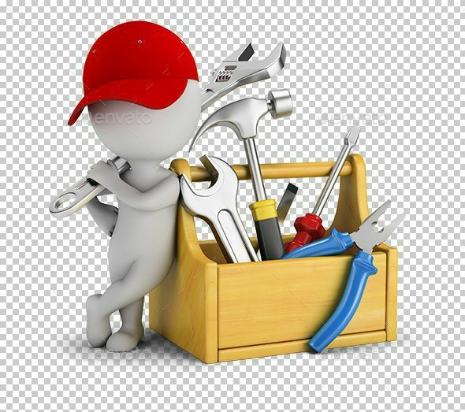

  

   

  <h3>Olá! 👋 Eu sou o Bruno Pereira</h3>
  
Engenheiro de Dados e Arquiteto Cloud focado em construir ecossistemas de dados confiáveis que transformam desafios complexos em valor de negócio.

---

###  Minha Caixa de Ferramentas

###  Minha Caixa de Ferramentas

  
  
  
  
  
  
   
  
  
  
   
  
  
  
   
  
  

---

###  Minha Caixa de Ferramentas

| Projeto | Descrição | Tecnologias |
| :--- | :--- | :--- |
| 📂 **[Framework de Reprocessamento Resiliente](URL_PARA_O_REPO_DO_FRAMEWORK)** | Um framework para reprocessamento robusto e monitorável de grandes volumes de dados no BigQuery. | `BigQuery`, `SQL`, `Python` |
| 📈 **[Nome de Outro Projeto Seu](URL_DO_PROJETO)** | Breve descrição do seu outro projeto. | `Tecnologia A`, `Tecnologia B` |

---

###  Como me Encontrar

  
  

---
